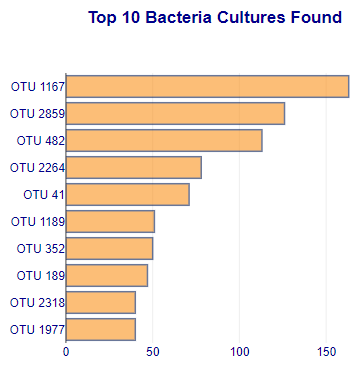

# Plotly Dashboarding

## Project Overview

Our Client has asked us to take bacterial sample data collected from the belly button of different volunteers and chart the data on an individualized basis. We are challenged to produce a dashboard that can select different individuals by their ID designation and produce 3 associated charts that depicts the bacterial and washing frequency as identified in the data. Additionally, we need to display the individual demographics for a chosen participant, top 10 bacterial cultures found, bacterial cultures per sample and a gauge chart that shows a fixed value of washing frequency. Our client is hoping to be able to visually draw conclusions based on the dashboard presentation and by being able to navigate seemlessly amongst the different individuals who provided samples for testing.

- Deliverables:
  1. Horizantal bar chart displaying the top 10 bacterial species (OTU's)
  2. Bubble chart showing bacterial cultures for a specific individual
  3. Gauge Chart showing weekly washing frequency
------------------------------------------------------------------------------------------------------------

## Resources
- Software: Visual Studio Code 1.56.2, JavaScript shell inside VS Code
- Browser : Google Chrome v91.0.4472.124 
- Libraries: Bootstrap v4.0, d3 v4.11.0, Plotly v1.58.5
------------------------------------------------------------------------------------------------------------

## Results

- The dashboard as presented in the webpage is shown below and displays the first individual with "ID: 940" in our dataset. The "Test Subject ID No." can be chosen from the drop down list of participants which updates the demographic information and related charts for each individual.

### Horizontal Bar Chart
- The horizontal bar chart shows the top 10 bacterial species found in the same data for the given individual identified from above.
  

### Bubble Chart
- This chart shows the different bacterial cultures per sample on an individualized basis.

### Gauge Chart
- The gauge depicts a fixed value taken directly from the demographics information and labeled as "WFREQ".

### Dashboard Customizations

- The following features were changed/added to cutomize the dashboard further:
  - The bubble chart was modified to use a heatmap called "Portland" that segregates the different bacterial cultures by a specific colorscale.
  - This chart also has an upgraded background color for the entire area occupied, axes and charting area.
  - A style file was added that makes the following changes:
    - The "jumbotron" title was modified with a background image of a bacterial-like culture.
    - The coloring of the "panel" and "well" were modified and both outlined with dark blue.
    - The "body" color was adjusted to dark blue and the font set to Arial.
  - The bar chart color was changed and each bar outlined with a marker color.

------------------------------------------------------------------------------------------------------------

## Summary Analysis

- The display results have met the deliverables and the website panel filtering performed as expected with valid data being returned for selected individuals. We can filter on one person and have all charts updated simultaneously to allow for a more visually comphrensive view of the data within the dashboard. Additional  elements can be added in the future if our client dtermines that further bacterial data needs to be represented on the dashboard for their project. 